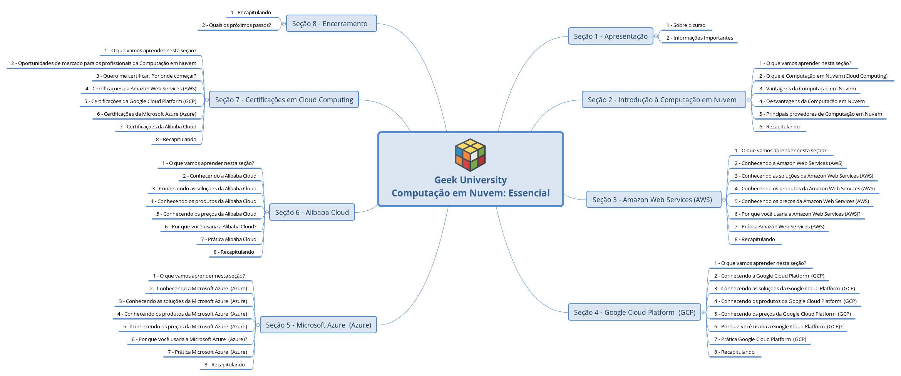

# Seção 01 — Apresentação

> Notas, resumo e material de apoio da Seção 01 (Apresentação) do curso "Computação em Nuvem (Cloud Computing): Essencial".

## Visão geral

Esta seção fornece a introdução ao curso: apresentação do instrutor, objetivos do curso, formato das aulas e um panorama dos conceitos fundamentais da computação em nuvem.

## Objetivos da Seção

- Apresentar o escopo e os objetivos do curso.
- Familiarizar o aluno com o vocabulário básico da nuvem.
- Mostrar a estrutura das próximas seções e o formato das atividades.
- Motivar o estudo com casos de uso e benefícios reais da nuvem.

## Tópicos abordados

- Boas-vindas e apresentação do instrutor
- Objetivos e público-alvo do curso
- Estrutura do curso (teoria, demonstrações, exercícios)
- Conceitos iniciais: computação em nuvem, regiões, zonas, instâncias
- Modelos de serviço: IaaS, PaaS, SaaS (visão geral)
- Modelos de implantação: pública, privada, híbrida
- Benefícios: escalabilidade, elasticidade, redução de custos, agilidade
- Recursos e materiais adicionais

## Resumo da aula

1. Abertura com apresentação do instrutor e motivação para aprender sobre nuvem.
2. Objetivos de aprendizagem: entender modelos de serviço, implantação e vantagens da nuvem.
3. Explicação rápida dos termos básicos (instância, região, disponibilidade, escala).
4. Visão geral dos conteúdos futuros e recomendação de estudo.

## Conceitos-chave (definições rápidas)

- Computação em nuvem: entrega de recursos computacionais sob demanda pela internet.
- IaaS (Infrastructure as a Service): fornece recursos de infraestrutura (VMs, rede, armazenamento).
- PaaS (Platform as a Service): plataforma gerenciada para desenvolvimento e execução de aplicações.
- SaaS (Software as a Service): aplicações prontas, acessíveis pela internet.
- Região/Zona: localizações físicas e lógicas onde os provedores de nuvem operam.
- Elasticidade vs. Escalabilidade: elasticidade é ajuste automático conforme a demanda; escalabilidade é a capacidade de crescer (vertical/horizontalmente).

## Materiais da Seção

- Imagem da apresentação: `Geek_University_Computacao_Em_Nuvem_Essencial.png`
- Este README (notas gerais)
- Espaço para adicionar links, exercícios e timestamps conforme forem sendo disponibilizados.

## Notas / Timestamps (preencha durante a aula)

- 00:00 — Abertura
- 02:30 — Objetivos do curso
- 06:10 — Modelos de serviço (IaaS/PaaS/SaaS)
- 10:45 — Modelos de implantação
- 14:00 — Recomendações e próximos passos

> Dica: substitua os timestamps acima pelos minutos reais da aula conforme você for assistindo.

## Como acompanhar e estudar

1. Assista à aula e faça anotações dos termos desconhecidos.
2. Revise as definições principais e procure exemplos práticos (AWS, Azure, GCP).
3. Pratique buscando as interfaces dos provedores e entendendo onde ficam regiões e zonas.
4. Marque dúvidas e compare com as próximas aulas para consolidar conceitos.

## Referências úteis

- Curso (Udemy): https://www.udemy.com/course/computacao-em-nuvem-essencial/
- Introdução (Wikipedia — Cloud computing): https://en.wikipedia.org/wiki/Cloud_computing

---
